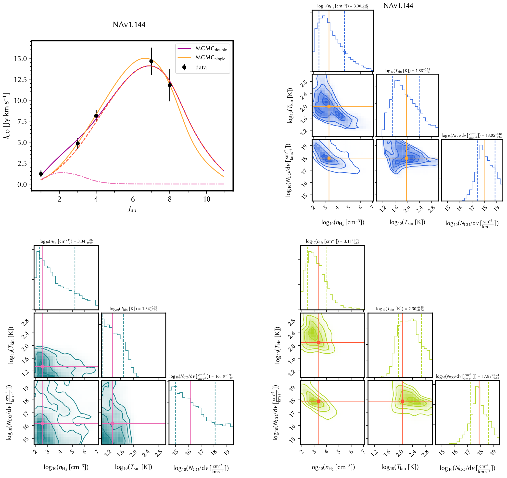
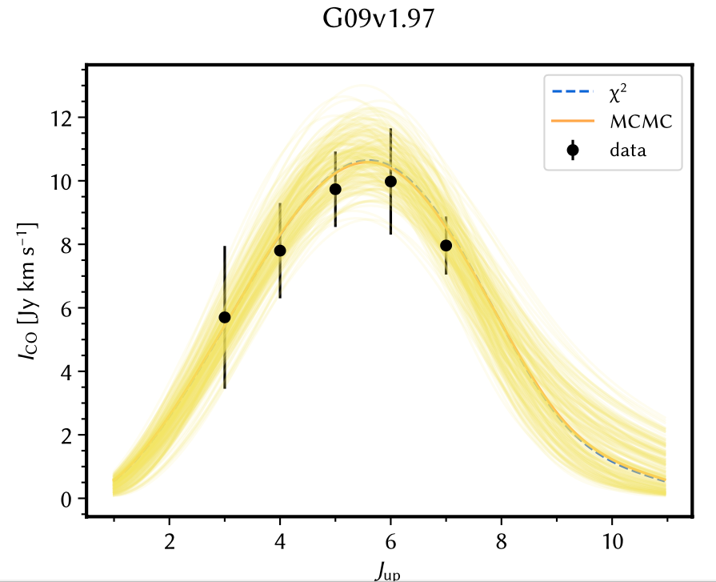

# The project of fitting SLED with `PyRADEX`+`emcee`


## Why use `RADEX`+`emcee` rather than using `RADEX` grids?

- This code combines `emcee` and `RADEX`, performing MCMC sampling in the RADEX-parameters space WITHOUT predefined grids, which leads to faster a convergence time and a better sampling of the parameter space.
- This code directly samples the parameter space with the Affine Invariant Markov chain Monte Carlo (MCMC) Ensemble sampler. This allows a much better sampling of the parameter space. 	

## How do you know the code is doing the right calculations? 
This is a very valid concern. Nevertheless, it is always the first practice to test your code on well-studied sources (and you can also test the code yourself by comparing with literatures). That's what has been done: 
- This code has been tested against a few well-studied sources. For example:
	- APM08279+5255, [Weiss et al. 2007](https://ui.adsabs.harvard.edu/abs/2007A%26A...467..955W/abstract): our results are entirely consistent with the results in this paper. Their values, log(n_H2/cm⁻³) = 4.2 and log(T_K/K) = 2.4, are within the +/-1 sigma values and close to the maximum likelihood values from the calculations based on this code.  
	- The Circinus Galaxy, [Zhang et al. 2014](https://ui.adsabs.harvard.edu/abs/2014A%26A...568A.122Z/abstract): similar to APM08279+5255, the results from our code are fully consistent with the results in the reference. 
 

## Installation & usage: 


### Dependence:

- `PyRadex`: https://github.com/keflavich/pyradex
- `emcee`: https://github.com/dfm/emcee
- `corner`: https://github.com/dfm/corner.py
- other common packages: `numpy`, `scipy`, `astropy`, `astroquery` 

### How to produce resulting plots:
- The results are stored in the `.pickle` files
- Just run `replot(“source_name”)` after executing the python script in `IPython`.
- You can always check the `.pickle` files without the need to rerun the whole code again. 
- A note on a possible decoding error for the Pickle file (Python 2 --> Python 3)
	- When you encounter an error using old Pickle file generated using Python 2: ``UnicodeDecodeError: 'ascii' codec can't decode byte 0xfa in position 0: ordinal not in range(128)`` 	
	- You can add `, encoding='latin1'` behind the line `= pickle.load(pkl_file)`, so as `= pickle.load(pkl_file, encoding='latin1')`. This should solve the issue.
- **Update**: added a function to plot 100 MCMC examples within the 1-sigma range for posteriors (See the last figure). 


### Change number of walkers and iterations:
- In `emcee_radex.py`, change the numbers between line 404-406.
- In `emcee_radex_2comp.py`, change the numbers between line 540-543.

### Change the solver of the radiation transfer

To use [`myradex`](https://github.com/fjdu/myRadex) (which may be more stable as mentioned in [Ginsberg et al. 2016](https://ui.adsabs.harvard.edu/abs/2016A%26A...586A..50G/abstract)) instead of RADEX, please uncomment the following line:

```
import pyradex.fjdu
```

You may also need to change `pyradex.Radex` to `pyradex.fjdu.Fjdu` , and remove `validate_colliders=False`.


## Directory structure:

- `README.md`: this file;
- `emcee`
	- `radex_moldata`: the molecular data;
	- `results`: the pickle files storing the MCMC results;
		- `single`: results of one-component fittings;
		- `double`: results of two-component fittings;
	- `emcee_radex.py`: one-component fitting code;
	- `emcee_radex_2comp.py`: warm + cold components, **in prior Tcold < Twarm; SizeCold>SizeWarm**;
- `data`
	- `flux.note`: explaining the data in Yang+2017;
	- `flux.dat`: **this is the flux data file read by** `emcee_radex.py`;
	- `flux_for2p.dat`: flux data used in `emcee_radex_2comp.py`;

## Fitting example:
A full example of a two-component fitting, the SLED plot and the corner plots:


Here gives an example of the updated plot style (see notes on *How to produce resulting plots*):


## Citation
Please cite our paper if you find this code useful. The paper also includes CO SLED data for 16 high-redshift submillimeter galaxies: [C. Yang, A. Omont, A. Beelen et al. 2017, A&A, 608, A144](http://adsabs.harvard.edu/abs/2017A%26A...608A.144Y). 

Bibtex:

```
@ARTICLE{2017A&A...608A.144Y,
       author = {{Yang}, C. and {Omont}, A. and {Beelen}, A. and {Gao}, Y. and
         {van der Werf}, P. and {Gavazzi}, R. and {Zhang}, Z. -Y. and
         {Ivison}, R. and {Lehnert}, M. and {Liu}, D. and {Oteo}, I. and
         {Gonz{\'a}lez-Alfonso}, E. and {Dannerbauer}, H. and {Cox}, P. and
         {Krips}, M. and {Neri}, R. and {Riechers}, D. and {Baker}, A.~J. and
         {Micha{\l}owski}, M.~J. and {Cooray}, A. and {Smail}, I.},
        title = "{Molecular gas in the Herschel-selected strongly lensed submillimeter galaxies at z   2-4 as probed by multi-J CO lines}",
      journal = {\aap},
     keywords = {galaxies: high-redshift, galaxies: ISM, infrared: galaxies, submillimeter: galaxies, radio lines: ISM, ISM: molecules, Astrophysics - Astrophysics of Galaxies},
         year = 2017,
        month = dec,
       volume = {608},
          eid = {A144},
        pages = {A144},
          doi = {10.1051/0004-6361/201731391},
archivePrefix = {arXiv},
       eprint = {1709.04740},
 primaryClass = {astro-ph.GA},
       adsurl = {https://ui.adsabs.harvard.edu/abs/2017A&A...608A.144Y},
      adsnote = {Provided by the SAO/NASA Astrophysics Data System}
}
```

## Authors of the code

Alexandre Beelen (ORCID: 0000-0003-3201-0185); Chentao Yang (ORCID: 0000-0002-8117-9991).
