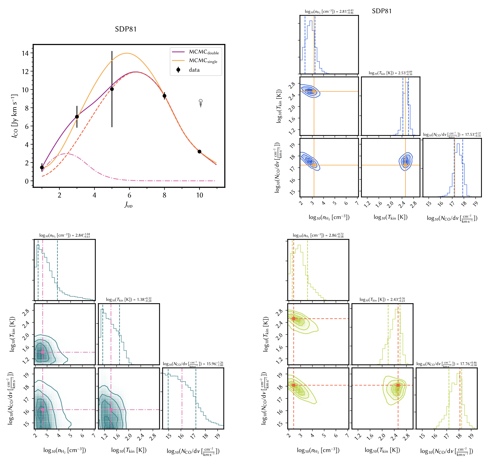

# The project of fitting SLED with `PyRADEX`+`emcee`
 
 
## Why use `RADEX`+`emcee` rather than using `RADEX` grids?

- This code combines `emcee` and `RADEX`, performing MCMC sampling on the RADEX-parameters space WITHOUT predefined grids, which leads to faster a convergence time and a better sampling of the parameter space.

- This code directly samples the parameter space with the Affine Invariant Markov chain Monte Carlo (MCMC) Ensemble sampler. This allows a much better sampling of the parameter space. 	
 
## Installation & usage: 

### Comments:
- Not the code is updated to work with Python 3.7.
	- Note that Python 3.8 *may* have issues with the `pyradex` package, you *may* encounter a decimal issue (more [here](https://github.com/keflavich/pyradex/issues/31)).  
	
- Simply use `replot` function to generate the figures.

### Dependence:

- `PyRadex`: https://github.com/keflavich/pyradex
	- You should have `f2py` installed
- `emcee`: https://github.com/dfm/emcee
- `corner`: https://github.com/dfm/corner.py
- other common packages: `numpy`, `scipy`, `astropy`, `astroquery` 
	- the code has been tested for `numpy 1.18.5`, `scipy 1.5.0`, and `astropy 4.0.1`.

### How to produce plots:
- Just run `replot('source_name')` after executing the python script in `IPython`.

### Change number of walkers and iterations:
- In `emcee_radex.py`, change the numbers between line 404-406.
- In `emcee_radex_2comp.py`, change the numbers between line 540-543.
	

## Directory structure:

- `README.md`: this file;
- `emcee`
	- `radex_moldata`: the molecular data;
	- `results`: the pickle files storing the MCMC results;
		- `single`: results of one-component fittings;
		- `double`: results of two-component fittings;
	- `emcee_radex.py`: one-component fitting code;
	- `emcee_radex_2comp.py`: warm + cold components, **in prior Tcold < Twarm; SizeCold>SizeWarm**;
- `data`
	- `flux.note`: explaining the data in Yang+2017;
	- `flux.dat`: **this is the flux data file read by** `emcee_radex.py`;
	- `flux_for2p.dat`: flux data used in `emcee_radex_2comp.py`;

## Fitting example:

## Citation
Data are published in C. Yang, A. Omont, A. Beelen et al. 2017, A&A, 608, A144.

***Please cite our paper (http://adsabs.harvard.edu/abs/2017A%26A...608A.144Y) if you find this code useful.***

## Authors of the code

Alexandre Beelen (ORCID: 0000-0003-3201-0185); Chentao Yang (ORCID: 0000-0002-8117-9991).
